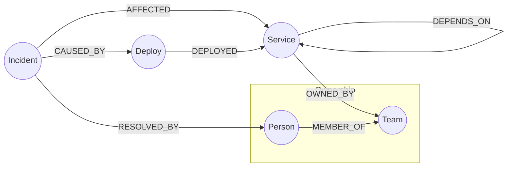

# Blast Radius: Microservice Incident Impact Explorer

A small web app for exploring a microservice dependency graph, built to
answer the question every on-call engineer asks during an incident: if this
service goes down, what else breaks, and who do I need to page?

Built on **CognoDB** (a managed graph database that speaks openCypher over
Bolt) using the official `neo4j-driver` for Node.js, with a Next.js +
TypeScript frontend.

- **Live demo:** _add your hosted URL here_
- **Screen recording:** _add your recording link here_

---

## 1. Why a graph database?

The core question this app answers ("what's the full downstream impact if
this service fails?") is a variable-depth transitive closure over a
`DEPENDS_ON` relationship. This is a case where a graph database is genuinely
the right tool, not just an interesting one to use.

The traversal depth isn't known ahead of time. Service A might be called by
B, which is called by C, which is called by D, and there's no way to know how
deep that chain goes until you actually walk it. In Cypher that's one
pattern: `(target)<-[:DEPENDS_ON*1..6]-(downstream)`. In a relational schema
you'd be writing a recursive CTE that self-joins a `service_dependencies`
table an unknown number of times, tracks visited rows to avoid looping on
cycles, and de-duplicates nodes reached through multiple paths at different
depths, before you can even get to the shortest hop count per node (which is
what `getBlastRadius` in [`src/lib/queries.ts`](src/lib/queries.ts) actually
needs to group results by).

The more interesting queries in this app are about implicit structure, not
stored facts. The "possibly related incidents" feature on the incident detail
page finds other incidents whose affected service sits within 3 hops
downstream of a given incident's root cause. That connection is never
recorded anywhere in the data itself; it only exists as a side effect of the
shape of the dependency graph. A relational schema would have to either
precompute and materialize that relationship (which goes stale the moment the
topology changes) or run the same awkward recursive join at query time.

Beyond that, the domain itself is a network more than it's a set of tables.
Services, teams, people, deploys, and incidents are connected by
relationships that matter as much as the records themselves: who owns what,
what caused what, what depends on what. Modeling that as labeled nodes and
typed relationships matches how engineers actually think about their
systems ("walk the graph from here") instead of routing every question
through a stack of join tables. And because Cypher traversals follow direct
pointers between nodes rather than joining tables, read performance for
these kinds of queries stays roughly flat as the graph grows, instead of
scaling with the size of the tables being joined.

None of this means a relational database *couldn't* store this data. It
could. But the two queries this app leans on most (multi-hop blast radius,
and incident correlation based on graph shape) are exactly the kind a graph
database makes natural and a relational one makes painful.

---

## 2. Data model



**Node labels & key properties**

| Label | Properties |
|---|---|
| `Service` | `name` (unique), `description`, `team`, `tier` (`critical` / `core` / `supporting`), `language` |
| `Team` | `name` (unique) |
| `Person` | `name`, `email` (unique), `role` |
| `Deploy` | `id` (unique), `version`, `timestamp`, `status` (`success` / `rolled_back`) |
| `Incident` | `id` (unique), `title`, `severity` (`SEV1`/`SEV2`/`SEV3`), `startedAt`, `resolvedAt`, `rootCause` |

**Relationship types**

| Relationship | Meaning |
|---|---|
| `(:Service)-[:DEPENDS_ON {critical: bool}]->(:Service)` | A calls/needs B. The core edge the blast-radius traversal walks |
| `(:Service)-[:OWNED_BY]->(:Team)` | Which team is responsible for a service |
| `(:Person)-[:MEMBER_OF]->(:Team)` | Team membership |
| `(:Deploy)-[:DEPLOYED]->(:Service)` | A deploy of a specific service |
| `(:Incident)-[:AFFECTED]->(:Service)` | The service an incident hit |
| `(:Incident)-[:CAUSED_BY]->(:Deploy)` | Optional. The deploy identified as root cause |
| `(:Incident)-[:RESOLVED_BY]->(:Person)` | Optional. Who resolved it |

Seed dataset: 28 services, 50 `DEPENDS_ON` edges, 6 teams, 10 people, 5
deploys, and 12 incidents, modeled as a layered e-commerce architecture (edge
layer, then storefront/checkout/fulfillment domains, then a shared data/infra
layer underneath). See [`seed/data.ts`](seed/data.ts).

---

## 3. The main queries, explained

All queries live in [`src/lib/queries.ts`](src/lib/queries.ts) and run
through the `runQuery` helper in
[`src/lib/neo4j.ts`](src/lib/neo4j.ts), which always passes values as bound
parameters (`session.run(cypher, params)`) rather than string-concatenating
them into the Cypher text.

### Blast radius (multi-hop traversal, the headline query)

```cypher
MATCH path = (target:Service {name: $name})<-[:DEPENDS_ON*1..6]-(downstream:Service)
WITH downstream, min(length(path)) AS hops
RETURN downstream, hops
ORDER BY hops, downstream.name
```

Walks `DEPENDS_ON` backwards from the target service, 1 to 6 hops out, and
keeps the shortest distance at which each downstream service is reachable
(since a service can be reachable through more than one path of different
lengths). This powers the "Blast radius if this goes down" section on each
service page.

### On-call chain (multi-hop traversal + relationship joins)

```cypher
MATCH path = (target:Service {name: $name})<-[:DEPENDS_ON*0..3]-(affected:Service)
WITH affected, min(length(path)) AS hops
MATCH (affected)-[:OWNED_BY]->(t:Team)<-[:MEMBER_OF]-(p:Person)
RETURN DISTINCT p, t, affected AS s, hops
ORDER BY hops, t.name, p.name
```

Extends the blast-radius pattern two more hops through team ownership and
team membership, to answer "who do I actually need to page" in a single
query.

### Related incidents (the query a relational schema would find awkward)

```cypher
MATCH (i:Incident {id: $id})-[:AFFECTED]->(root:Service)
MATCH path = (root)<-[:DEPENDS_ON*1..3]-(affected:Service)
MATCH (i2:Incident)-[:AFFECTED]->(affected)
WHERE i2.id <> $id
WITH i2, affected AS s2, min(length(path)) AS hops
RETURN i2, s2, hops
ORDER BY hops, i2.startedAt DESC
LIMIT 10
```

Finds other incidents whose affected service is within 3 hops downstream of
this incident's root-cause service, surfacing plausible cascading failures
that have no explicit link in the incident records themselves, only an
implicit one through the shape of the dependency graph.

### Full graph (for the explorer visualization)

```cypher
MATCH (a:Service)-[rel:DEPENDS_ON]->(b:Service)
RETURN a.name AS a, b.name AS b, rel
```

Feeds the force-directed graph on `/explorer`.

---

## 4. Project structure

```
wexa-graph-app/
├── seed/
│   ├── data.ts          # seed dataset (services, deploys, incidents, people...)
│   └── seed.ts           # loads seed/data.ts into the configured database
├── src/
│   ├── lib/
│   │   ├── neo4j.ts       # driver singleton, parameterized runQuery(), error handling
│   │   ├── queries.ts     # every Cypher query used by the app
│   │   └── types.ts       # shared TypeScript domain types
│   ├── components/        # UI building blocks (badges, empty/loading/error states, graph)
│   └── app/
│       ├── page.tsx                       # dashboard (service list)
│       ├── services/[name]/page.tsx       # service detail: blast radius, on-call, incidents
│       ├── incidents/page.tsx             # incident list
│       ├── incidents/[id]/page.tsx        # incident detail: related incidents
│       ├── explorer/page.tsx              # interactive dependency graph
│       └── api/                           # REST endpoints (services, blast-radius, graph, health)
├── docker-compose.yml     # local Neo4j for development (same Bolt/Cypher protocol as CognoDB)
└── .env.local.example
```

---

## 5. Setup & run

### 5.1 Create your CognoDB instance

1. Sign up at [console.cognodb.com/signup](https://console.cognodb.com/signup) (no credit card needed for the free tier).
2. Create a free (`c0`) instance and pick a region. It provisions in under a minute.
3. Copy the connection URI (`bolt+s://<instance-id>.databases.cognodb.cloud`) and the generated password for user `cognodb`. The password is shown once, so save it right away.

### 5.2 Configure environment variables

```bash
cp .env.local.example .env.local
```

Fill in either the CognoDB values, or point at a local Neo4j instead (see 5.3):

```bash
NEO4J_URI=bolt+s://<instance-id>.databases.cognodb.cloud
NEO4J_USER=cognodb
NEO4J_PASSWORD=<your generated password>
NEO4J_DATABASE=neo4j
```

`.env.local` is gitignored, so credentials never get committed.

### 5.3 (Optional) run a local database instead

CognoDB speaks the same Bolt/openCypher protocol as Neo4j, so you can develop
against a local Neo4j container and swap in real CognoDB credentials later
without changing any code:

```bash
docker compose up -d
# .env.local.example already has matching local defaults
```

### 5.4 Install, seed, and run

```bash
npm install
npm run seed   # loads seed/data.ts into whatever NEO4J_URI points at
npm run dev    # http://localhost:3000
```

### 5.5 Build for production

```bash
npm run build
npm run start
```

---

## 6. Deployment

Deployed on the Vercel free tier, pointed at a CognoDB Cloud instance, with
`NEO4J_URI` / `NEO4J_USER` / `NEO4J_PASSWORD` / `NEO4J_DATABASE` set as
Vercel environment variables (never committed to the repo).

_Live demo: add link here._

---

## 7. Screenshots

_Add screenshots of the dashboard, a service detail page (blast radius), an
incident detail page (related incidents), and the graph explorer here._

---

## 8. Engineering notes

- **Connection handling:** a single driver instance is reused across
  requests (`src/lib/neo4j.ts`). Every route checks connectivity first and
  renders a `DbErrorBanner` instead of crashing if the database is
  unreachable (tested by stopping the local Neo4j container mid-session and
  confirming the app degrades gracefully).
- **Parameterization:** every Cypher query goes through
  `session.run(cypher, params)` with bound parameters. The one exception is
  the variable-length relationship bound (`*1..N`), which Cypher doesn't
  support parameterizing directly, so that integer is validated and clamped
  server-side (see `clampHops` in the blast-radius API route) instead of ever
  being built from unvalidated input.
- **Seed data is idempotent:** `npm run seed` wipes and reloads the graph, so
  it's safe to re-run against a fresh or dirty database.
