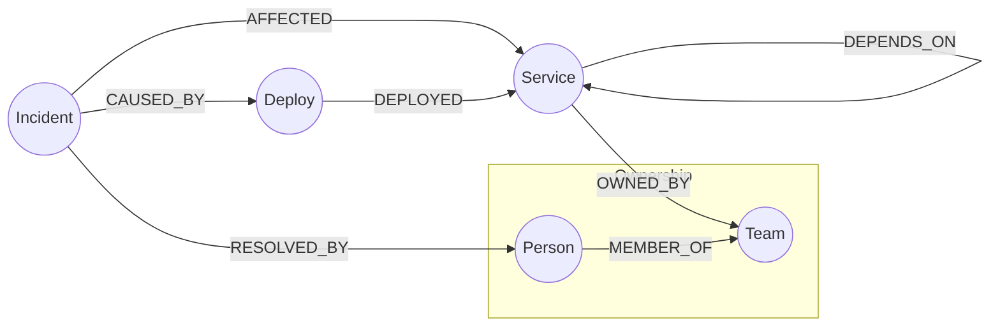

# Blast Radius — Microservice Incident Impact Explorer

A small web app for exploring a microservice dependency graph and answering
the question every on-call engineer asks during an incident:

> **"If this service goes down, what else breaks — and who do I need to page?"**

Built on **CognoDB** (a managed graph database speaking openCypher over Bolt)
via the official `neo4j-driver` for Node.js, with a Next.js + TypeScript
frontend.

- **Live demo:** _add your hosted URL here_
- **Screen recording:** _add your recording link here_

---

## 1. Why a graph database?

The core question this app answers — *"what is the full downstream impact of
this service failing?"* — is a **variable-depth transitive closure** over a
`DEPENDS_ON` relationship. That's the textbook case where a graph database
earns its place over a relational one:

- **The traversal depth is unknown ahead of time.** Service A might be called
  by B, which is called by C, which is called by D — and you don't know how
  many hops deep the dependency chain goes until you walk it. In Cypher this
  is one pattern: `(target)<-[:DEPENDS_ON*1..6]-(downstream)`. In SQL, the
  equivalent is a **recursive CTE** that self-joins a `service_dependencies`
  table an unbounded number of times, manually tracks visited nodes to avoid
  infinite loops on cycles, and de-duplicates nodes reached via multiple
  paths at different depths — all before you can even compute the *shortest*
  hop count per node, which this app uses to group results (see
  `getBlastRadius` in [`src/lib/queries.ts`](src/lib/queries.ts)).
- **The interesting queries are about implicit structure, not stored facts.**
  The "possibly related incidents" feature (see the incident detail page)
  finds other incidents whose affected service sits within 3 hops downstream
  of a given incident's root cause — a connection that is **never recorded
  anywhere in the data**. It only exists as a byproduct of the shape of the
  dependency graph. A relational schema would need to either precompute and
  materialize this relationship (stale the moment the topology changes) or
  run an equally awkward recursive join at query time.
- **The domain is inherently a network, not a set of tables.** Services,
  teams, people, deploys, and incidents are all connected by relationships
  that matter as much as the entities themselves (who owns what, what caused
  what, what depends on what). Modeling this as first-class labeled nodes and
  typed relationships makes the model match how engineers actually reason
  about their systems — "walk the graph from here" — rather than forcing
  every question through a maze of join tables.
- **Read performance stays flat as the graph grows.** Cypher traversals are
  index-free-adjacency lookups (follow a pointer to the next node) rather
  than the join tables required in a relational model, whose cost grows with
  the size of the tables being joined, not the size of the actual
  neighborhood being explored.

None of this is to say a relational database *couldn't* store this data — it
could. But the two queries this app leans on hardest (multi-hop blast radius,
and graph-shape-based incident correlation) are precisely the ones a graph
database makes natural and a relational one makes painful.

---

## 2. Data model



**Node labels & key properties**

| Label | Properties |
|---|---|
| `Service` | `name` (unique), `description`, `team`, `tier` (`critical` / `core` / `supporting`), `language` |
| `Team` | `name` (unique) |
| `Person` | `name`, `email` (unique), `role` |
| `Deploy` | `id` (unique), `version`, `timestamp`, `status` (`success` / `rolled_back`) |
| `Incident` | `id` (unique), `title`, `severity` (`SEV1`/`SEV2`/`SEV3`), `startedAt`, `resolvedAt`, `rootCause` |

**Relationship types**

| Relationship | Direction | Meaning |
|---|---|---|
| `(:Service)-[:DEPENDS_ON {critical: bool}]->(:Service)` | A calls/needs B | The core dependency edge the blast-radius traversal walks |
| `(:Service)-[:OWNED_BY]->(:Team)` | | Which team is responsible for a service |
| `(:Person)-[:MEMBER_OF]->(:Team)` | | Team membership |
| `(:Deploy)-[:DEPLOYED]->(:Service)` | | A deploy of a specific service |
| `(:Incident)-[:AFFECTED]->(:Service)` | | The service an incident hit |
| `(:Incident)-[:CAUSED_BY]->(:Deploy)` | | Optional: the deploy identified as root cause |
| `(:Incident)-[:RESOLVED_BY]->(:Person)` | | Optional: who resolved it |

Seed dataset: **28 services, 50 `DEPENDS_ON` edges, 6 teams, 10 people, 5
deploys, 12 incidents** — a realistic layered e-commerce architecture (edge
→ storefront/checkout/fulfillment domains → shared data/infra layer). See
[`seed/data.ts`](seed/data.ts).

---

## 3. The main queries, explained

All queries live in [`src/lib/queries.ts`](src/lib/queries.ts) and run
through [`src/lib/neo4j.ts`](src/lib/neo4j.ts)'s `runQuery` helper, which
always passes values as **bound parameters** (`session.run(cypher, params)`)
— never string-concatenated into the Cypher text.

### Blast radius (multi-hop traversal, the headline query)

```cypher
MATCH path = (target:Service {name: $name})<-[:DEPENDS_ON*1..6]-(downstream:Service)
WITH downstream, min(length(path)) AS hops
RETURN downstream, hops
ORDER BY hops, downstream.name
```

Walks `DEPENDS_ON` backwards from the target service, 1 to 6 hops, and keeps
the **shortest** distance at which each downstream service is reachable
(a service might be reachable via multiple paths of different lengths). This
powers the "Blast radius if this goes down" section on each service page.

### On-call chain (multi-hop traversal + relationship joins)

```cypher
MATCH path = (target:Service {name: $name})<-[:DEPENDS_ON*0..3]-(affected:Service)
WITH affected, min(length(path)) AS hops
MATCH (affected)-[:OWNED_BY]->(t:Team)<-[:MEMBER_OF]-(p:Person)
RETURN DISTINCT p, t, affected AS s, hops
ORDER BY hops, t.name, p.name
```

Extends the blast-radius pattern two more hops through team ownership and
team membership to answer "who do I actually need to page" in one query.

### Related incidents (the "awkward in SQL" query)

```cypher
MATCH (i:Incident {id: $id})-[:AFFECTED]->(root:Service)
MATCH path = (root)<-[:DEPENDS_ON*1..3]-(affected:Service)
MATCH (i2:Incident)-[:AFFECTED]->(affected)
WHERE i2.id <> $id
WITH i2, affected AS s2, min(length(path)) AS hops
RETURN i2, s2, hops
ORDER BY hops, i2.startedAt DESC
LIMIT 10
```

Finds other incidents whose affected service is within 3 hops downstream of
this incident's root-cause service — surfacing plausible cascading failures
that share no explicit link in the incident records themselves, only an
implicit one via the dependency graph's shape.

### Full graph (for the explorer visualization)

```cypher
MATCH (a:Service)-[rel:DEPENDS_ON]->(b:Service)
RETURN a.name AS a, b.name AS b, rel
```

Feeds the force-directed graph on `/explorer`.

---

## 4. Project structure

```
wexa-graph-app/
├── seed/
│   ├── data.ts          # seed dataset (services, deploys, incidents, people...)
│   └── seed.ts           # loads seed/data.ts into the configured database
├── src/
│   ├── lib/
│   │   ├── neo4j.ts       # driver singleton, parameterized runQuery(), error handling
│   │   ├── queries.ts     # every Cypher query used by the app
│   │   └── types.ts       # shared TypeScript domain types
│   ├── components/        # UI building blocks (badges, empty/loading/error states, graph)
│   └── app/
│       ├── page.tsx                       # dashboard (service list)
│       ├── services/[name]/page.tsx       # service detail: blast radius, on-call, incidents
│       ├── incidents/page.tsx             # incident list
│       ├── incidents/[id]/page.tsx        # incident detail: related incidents
│       ├── explorer/page.tsx              # interactive dependency graph
│       └── api/                           # REST endpoints (services, blast-radius, graph, health)
├── docker-compose.yml     # local Neo4j for development (same Bolt/Cypher protocol as CognoDB)
└── .env.local.example
```

---

## 5. Setup & run

### 5.1 Create your CognoDB instance

1. Sign up at [console.cognodb.com/signup](https://console.cognodb.com/signup) (no credit card needed for the free tier).
2. Create a free (`c0`) instance and pick a region — provisions in under a minute.
3. Copy the connection URI (`bolt+s://<instance-id>.databases.cognodb.cloud`) and the generated password for user `cognodb` — **the password is shown once**, save it now.

### 5.2 Configure environment variables

```bash
cp .env.local.example .env.local
```

Fill in either the CognoDB values or point at a local Neo4j (see 5.3):

```bash
NEO4J_URI=bolt+s://<instance-id>.databases.cognodb.cloud
NEO4J_USER=cognodb
NEO4J_PASSWORD=<your generated password>
NEO4J_DATABASE=neo4j
```

`.env.local` is gitignored — credentials are never committed.

### 5.3 (Optional) run a local database instead

CognoDB speaks the same Bolt/openCypher protocol as Neo4j, so you can develop
against a local Neo4j container and swap in real CognoDB credentials later
with zero code changes:

```bash
docker compose up -d
# .env.local.example already has matching local defaults
```

### 5.4 Install, seed, and run

```bash
npm install
npm run seed   # loads seed/data.ts into whatever NEO4J_URI points at
npm run dev    # http://localhost:3000
```

### 5.5 Build for production

```bash
npm run build
npm run start
```

---

## 6. Deployment

Deployed on [Vercel free tier] pointed at a CognoDB Cloud instance, with
`NEO4J_URI` / `NEO4J_USER` / `NEO4J_PASSWORD` / `NEO4J_DATABASE` set as
Vercel environment variables (never committed to the repo).

_Live demo: add link here._

---

## 7. Screenshots

_Add screenshots of the dashboard, a service detail page (blast radius), an
incident detail page (related incidents), and the graph explorer here._

---

## 8. Engineering notes

- **Connection handling:** a single driver instance is reused across
  requests (`src/lib/neo4j.ts`); every route checks connectivity and renders
  a `DbErrorBanner` instead of crashing if the database is unreachable
  (tested by stopping the local Neo4j container mid-session).
- **Parameterization:** every Cypher query goes through `session.run(cypher, params)`
  with bound parameters — the one exception is the variable-length relationship
  bound (`*1..N`), which Cypher does not allow parameterizing; that integer is
  validated/clamped server-side (see `clampHops` in the blast-radius API route)
  rather than ever being built from unvalidated string input.
- **Seed data is idempotent:** `npm run seed` wipes and reloads the graph, so
  it's safe to re-run against a fresh or dirty database.
